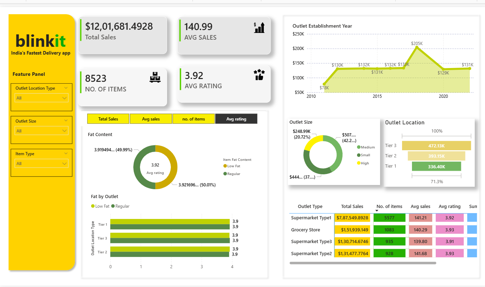

# Blinkit Sales Analytics Dashboard

## Overview
An interactive Power BI dashboard built to analyze Blinkit grocery sales data and outlet performance.

## Key Metrics
- Total Sales
- Average Sales
- Number of Items
- Average Rating

## Dashboard Features
- KPI Cards
- Interactive Filters
- Sales Trend Analysis
- Outlet Location Analysis
- Fat Content Analysis
- Matrix Visualization

## Tools Used
- Power BI
- Excel
- Data Visualization

## Dashboard Preview

## Files Included
- blinkit_dashboard.pbix
- BlinkIT Grocery Data.xlsx
- blinkit_dashboard1.png
- blinkit_dashboard2.png
